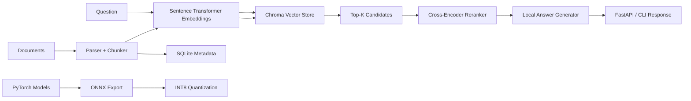

# On-Device Retrieval-Augmented Assistant

An end-to-end local RAG assistant optimized for constrained devices. The project uses local
Sentence Transformers embeddings, a Chroma vector store, SQLite metadata, optional cross-encoder
reranking, FastAPI serving, PyTorch/ONNX export, and INT8 quantization tooling.

## What it includes

- Local document ingestion for `.txt`, `.md`, `.html`, and `.pdf` files
- Chunking with LangChain text splitters and a no-dependency fallback
- Sentence Transformers embeddings with a deterministic hashing fallback for tests and demos
- Persistent Chroma retrieval with a small SQLite vector fallback when Chroma is unavailable
- SQLite metadata store for documents, chunks, and query metrics
- Cross-encoder reranking with lexical fallback
- Extractive CPU-friendly answer synthesis, plus optional local `transformers` generation
- FastAPI service and Typer CLI
- Benchmarking for latency and NDCG@K-style relevance checks
- ONNX export and dynamic INT8 quantization utilities

## Architecture



## Quickstart

```bash
python -m venv .venv
source .venv/bin/activate
python -m pip install -e ".[dev]"
cp .env.example .env
```

Ingest the sample corpus and ask a question:

```bash
odra ingest data/sample_docs --recursive
odra ask "How does the assistant reduce memory usage on edge hardware?"
```

Run the API:

```bash
uvicorn on_device_assistant.api:app --host 0.0.0.0 --port 8000 --reload
```

Query it:

```bash
curl -X POST http://localhost:8000/query \
  -H "Content-Type: application/json" \
  -d '{"question":"How is retrieval latency kept low?","top_k":5}'
```

## API

| Method | Path | Purpose |
| --- | --- | --- |
| `GET` | `/health` | Report store status and corpus size |
| `POST` | `/documents` | Ingest raw text |
| `POST` | `/documents/files` | Upload and ingest a text-like file |
| `POST` | `/query` | Retrieve, rerank, and answer |
| `DELETE` | `/documents` | Clear local stores |

## CLI

```bash
odra ingest ./docs --recursive
odra ask "What are the memory constraints?" --top-k 8
odra benchmark --eval-file data/eval/eval_queries.jsonl --iterations 10
odra export-onnx --model sentence-transformers/all-MiniLM-L6-v2 --output models/encoder.onnx
odra quantize-onnx models/encoder.onnx --output models/encoder.int8.onnx
```

## Configuration

Environment variables use the `ODRA_` prefix.

| Variable | Default |
| --- | --- |
| `ODRA_DATA_DIR` | `.odra` |
| `ODRA_SQLITE_PATH` | `.odra/assistant.sqlite3` |
| `ODRA_CHROMA_PATH` | `.odra/chroma` |
| `ODRA_COLLECTION_NAME` | `on_device_rag` |
| `ODRA_EMBEDDING_MODEL` | `sentence-transformers/all-MiniLM-L6-v2` |
| `ODRA_RERANKER_MODEL` | `cross-encoder/ms-marco-MiniLM-L-6-v2` |
| `ODRA_GENERATOR_MODEL` | empty, uses extractive generator |
| `ODRA_CHUNK_SIZE` | `650` |
| `ODRA_CHUNK_OVERLAP` | `100` |
| `ODRA_DEFAULT_TOP_K` | `5` |

For fully offline deployments, pre-download model weights into the local Hugging Face cache or mount
them into the device image.

## Benchmarks

The benchmark command records retrieval latency, end-to-end latency, and optional NDCG@K when eval
rows include `relevant_source_ids`.

```json
{"question":"How is retrieval latency optimized?","top_k":5,"relevant_source_ids":["edge_rag_overview"]}
```

## Development

```bash
make install-dev
make lint
make test
```

The test suite uses hashing embeddings and an in-memory vector store to keep CI fast. Production
installs use Sentence Transformers and Chroma by default.
